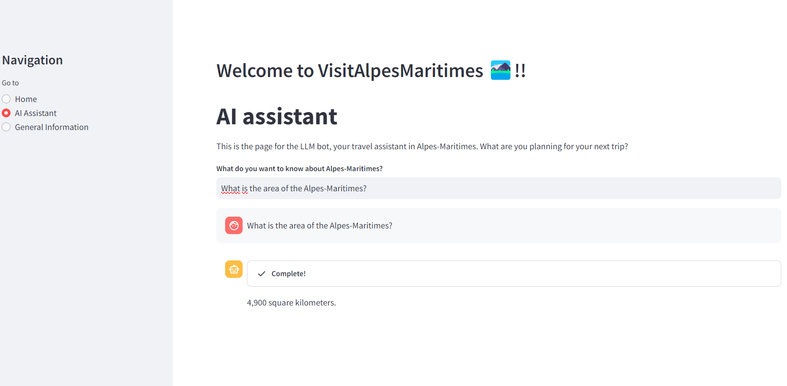
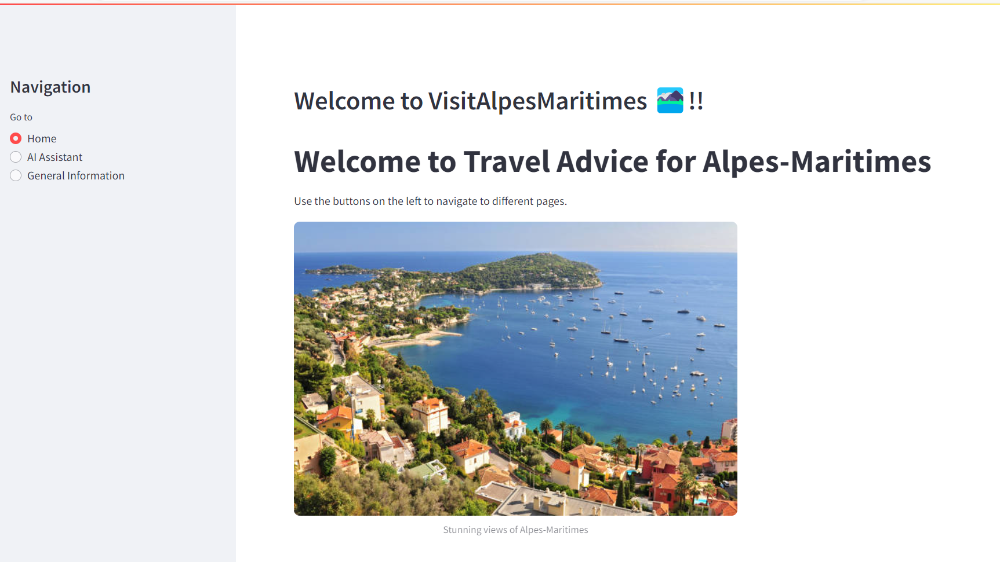
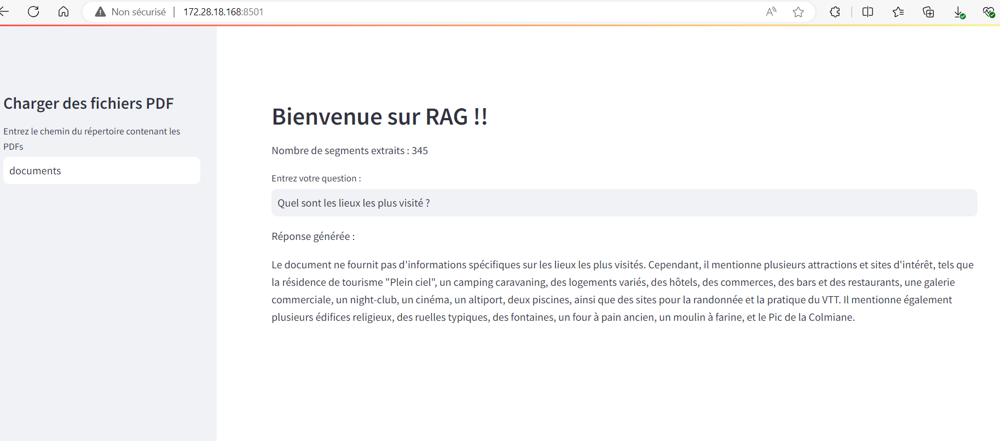

# RAG Retrieval-Augmented Generation 

## Project Objectives: Conversational Agent for Exploring the Alpes-Maritimes
This project aims to develop an innovative conversational agent based on a Retrieval-Augmented Generation (RAG) system to assist users in exploring and discovering the Alpes-Maritimes. The interactive tool will enable users to plan their trips and obtain precise, personalized information about tourist attractions, activities, accommodations, and local events.

### Creation Steps:

#### Data Collection and Preprocessing:

* Gather a rich and diverse knowledge base about the Alpes-Maritimes, including information on tourist sites, activities, accommodations, and events.

 * Preprocess the data 

#### Selection and Configuration of the Language Model:GPT4o

#### Implementation of an Information Retrieval System:

#### Develop a conversational user interface that facilitates interaction with the agent.

